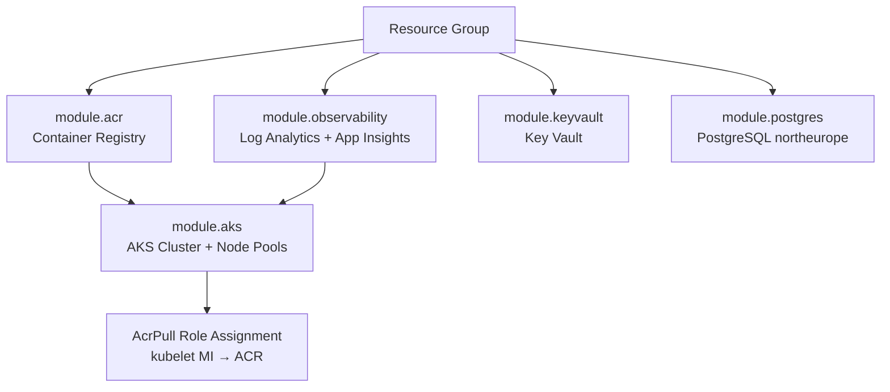

# System Architecture

> **Live**: Dev environment deployed — 29 May 2026  
> All infrastructure managed by **Terraform**. All deployments automated via **GitHub Actions**.

---

## Cloud Topology

```
┌─────────────────────────────────────────────────────────────────────┐
│                         Internet / Users                            │
└──────────────────────────────┬──────────────────────────────────────┘
                               │ HTTP  (sslip.io wildcard DNS)
                               ▼
┌──────────────────────────────────────────────────────────────────────┐
│  Azure Load Balancer  (IP: 4.231.68.185)                             │
│  Port 80 → NodePort 32024  /  Port 443 → NodePort 31352              │
│  Health Probe: GET /healthz on NodePort 32024                        │
└──────────────────────────────┬───────────────────────────────────────┘
                               │
┌──────────────────────────────▼───────────────────────────────────────┐
│              Azure Kubernetes Service — aks-locationshared-dev        │
│              westeurope · SKU: Free · Azure CNI · Azure Network Policy│
│                                                                       │
│  ┌──────────────────────┐    ┌───────────────────────────────────┐   │
│  │  System Node Pool    │    │       User Node Pool              │   │
│  │  1× Standard_D2s_v5  │    │       2× Standard_D4s_v5          │   │
│  │  OS: AzureLinux      │    │       OS: AzureLinux              │   │
│  │  critical pods only  │    │       application workloads       │   │
│  └──────────────────────┘    └───────────────────────────────────┘   │
│                                                                       │
│  Namespace: ingress-nginx                                             │
│  ┌──────────────────────────────────────────────────────────────┐    │
│  │  nginx Ingress Controller (Helm-managed)                     │    │
│  │  Azure LB health probe path: /healthz                        │    │
│  └──────────────────────┬─────────────────────────────────────┘     │
│                          │ Host-based routing                         │
│  Namespace: location-shared                                           │
│  ┌──────────────────────┐   ┌──────────────────────────────────┐    │
│  │  frontend (Next.js)  │   │  backend (FastAPI)               │    │
│  │  Deployment · 2 pods │   │  Deployment · 2 pods             │    │
│  │  HPA: 2–10 replicas  │   │  HPA: 2–10 replicas              │    │
│  │  Service: ClusterIP  │   │  Service: ClusterIP              │    │
│  └──────────────────────┘   └──────────────────────────────────┘    │
└──────────────────────────────────────────────────────────────────────┘
          │ image pull                            │ SQL (port 5432)
          ▼                                       ▼
┌──────────────────────┐         ┌──────────────────────────────────────┐
│  Azure Container     │         │  PostgreSQL 16 Flexible Server       │
│  Registry (ACR)      │         │  pg-locationshared-dev               │
│  westeurope · Basic  │         │  northeurope · B_Standard_B1ms       │
│  Pull: Managed ID    │         │  DB: location_shared · 32 GB         │
└──────────────────────┘         └──────────────────────────────────────┘
```

---

## Public Endpoints (Dev)

| Service | URL |
|---|---|
| Frontend | http://location-shared.4.231.68.185.sslip.io |
| API | http://api.location-shared.4.231.68.185.sslip.io |
| API Health | http://api.location-shared.4.231.68.185.sslip.io/health |
| API Docs | http://api.location-shared.4.231.68.185.sslip.io/docs |

> `sslip.io` resolves any hostname containing a dotted IP address back to that IP — no DNS configuration required.

---

## Azure Resources

### Application Resource Group: `rg-locationshared-dev`

| Resource | Type | Location | Purpose |
|---|---|---|---|
| `aks-locationshared-dev` | AKS Cluster | westeurope | Runs all application containers |
| `locationshareddev{rand}` | Container Registry | westeurope | Stores Docker images (AcrPull via Managed Identity) |
| `pg-locationshared-dev` | PostgreSQL Flexible Server | **northeurope** | Application database |
| `kvlocationshareddev` | Key Vault | westeurope | Secrets store |
| `law-locationshared-dev` | Log Analytics Workspace | westeurope | Log aggregation |
| `appi-locationshared-dev` | Application Insights | westeurope | APM & distributed tracing |

> **PostgreSQL location**: Deployed to `northeurope` because PostgreSQL Flexible Server is offer-restricted in `westeurope` on this Startup Credit subscription. Network latency impact is negligible (< 5 ms). See [Troubleshooting](./troubleshooting.md).

### Terraform State Resource Group: `rg-locationshared-tfstate`

| Resource | Details |
|---|---|
| Storage Account | `stlcsharedtfstate` |
| Container | `tfstate` |
| State key (dev) | `dev.terraform.tfstate` |
| State key (prod) | `prod.terraform.tfstate` |
| Location | westeurope |

This resource group is **separate** from the application RG and must exist before the first Terraform run.

---

## Application Architecture

### Backend: FastAPI

```
app/
├── main.py                  # App factory: CORS middleware, router registration, DB init
├── api/
│   ├── deps.py              # get_current_user dependency (JWT → User)
│   └── routes/
│       ├── auth.py          # POST /auth/register, /auth/login, /auth/google, GET /auth/me
│       ├── health.py        # GET /health  (liveness probe)
│       ├── locations.py     # CRUD /api/v1/locations
│       ├── profile.py       # GET/PUT /api/v1/profile
│       ├── share_codes.py   # POST/GET/DELETE /api/v1/share-codes
│       └── subscriptions.py # POST /api/v1/subscriptions/*, Stripe webhooks
├── core/
│   ├── config.py            # Pydantic Settings (env vars)
│   └── security.py          # JWT creation/verification, password hashing (bcrypt)
├── db/
│   └── session.py           # SQLAlchemy engine + session factory
├── models/
│   └── models.py            # ORM: User, Location, ShareCode, UserProfile, PaymentRecord
├── schemas/                 # Pydantic request/response models (separate per domain)
└── services/
    ├── google_auth.py       # Google ID token verification
    ├── share_code.py        # Unique 6-char code generation
    └── subscription.py      # Plan limits, location quota checks
```

### Frontend: Next.js (App Router)

```
app/
├── page.tsx        # Home — map view + location list
├── login/          # Email/password + Google OAuth entry
├── register/       # Account creation
├── account/        # Subscription management, profile settings
└── open/           # Share code resolution (no auth required)

lib/
├── api.ts          # Typed fetch wrapper with base URL + JWT header injection
└── types.ts        # Shared TypeScript interfaces
```

---

## Data Models

```
┌──────────────────────────────────────────────────────────────────────┐
│  User                                                                │
│  id (uuid) · email · password_hash · google_sub                      │
│  full_name · plan (free|pro) · subscription_status                   │
│  stripe_customer_id · stripe_subscription_id · created_at            │
└──────┬──────────────────────────┬──────────────────────────┬─────────┘
       │ 1:N                      │ 1:1                      │ 1:N
       ▼                          ▼                          ▼
┌─────────────────┐   ┌──────────────────────┐   ┌──────────────────┐
│  Location       │   │  UserAccountProfile  │   │  PaymentRecord   │
│  id · user_id   │   │  user_id (PK/FK)     │   │  id · user_id    │
│  name · note    │   │  username · avatar   │   │  stripe_event_id │
│  latitude       │   │  updated_at          │   │  amount · status │
│  longitude      │   └──────────────────────┘   └──────────────────┘
│  created_at     │
│  updated_at     │
└─────────────────┘
       
┌──────────────────────────────────────────────────────────────────────┐
│  ShareCode                                                           │
│  id (uuid) · code (6-char unique) · user_id (FK) · location_id (FK) │
│  location_name · latitude · longitude · uses · expires_at            │
└──────────────────────────────────────────────────────────────────────┘
```

---

## Request Lifecycle

### 1 — Browser to Pod

```
Browser
  └─► sslip.io DNS → 4.231.68.185 (Azure Load Balancer)
        └─► NodePort 32024 → nginx Ingress Controller pod
              └─► Host header match → ClusterIP Service
                    └─► One of N backend/frontend pods (round-robin)
```

### 2 — Authentication Flow

```
User submits credentials
  └─► POST /api/v1/auth/login  (email+password)  OR
      POST /api/v1/auth/google (Google ID token)
            │
            ▼
      Backend validates credentials / calls Google tokeninfo API
            │
            ▼
      JWT access token (30 min) + refresh token (7 days) issued
            │
            ▼
      Frontend stores tokens, attaches Authorization: Bearer <token>
      to all subsequent API calls
```

### 3 — Location Share Flow

```
Authenticated user creates share code:
  POST /api/v1/share-codes { latitude, longitude, location_name }
    └─► 6-char code generated (UUID-based, unique check in DB)
    └─► ShareCode row written to PostgreSQL
    └─► Code returned → user copies URL: /open?code=ABC123

Recipient opens share URL (no login required):
  GET /api/v1/share-codes/ABC123
    └─► DB lookup → expiry check → uses counter incremented
    └─► Coordinates returned → map rendered in browser
```

### 4 — CI/CD Delivery Pipeline

```
Developer push to main branch
  └─► GitHub Actions: deploy-dev.yml triggered
        │
        ├─[1]─ OIDC → Azure AD → short-lived ARM token
        ├─[2]─ Terraform init + apply (infrastructure converged)
        ├─[3]─ docker build → az acr push (tagged with commit SHA)
        ├─[4]─ az aks get-credentials
        ├─[5]─ kubectl apply (Kubernetes Secrets upserted)
        └─[6]─ kubectl apply (Deployments with new image SHA)
                └─► kubectl rollout status --timeout=180s
                      └─► Rolling update: new pods start, old pods terminate
                            └─► Azure Load Balancer health probe verifies /healthz
                                  └─► Users served by new version
```

---

## Security Model

| Concern | Mechanism |
|---|---|
| CI/CD Azure auth | OIDC federated credential — no stored passwords |
| AKS → ACR image pull | AKS kubelet Managed Identity + AcrPull role assignment (Terraform-managed) |
| Application secrets | Kubernetes Secrets (`app-secrets`) created by CI from GitHub Secrets |
| JWT signing | HS256, secret from Kubernetes Secret, 30-min access / 7-day refresh |
| Password storage | bcrypt hash — plaintext never stored |
| DB connection | PostgreSQL admin password injected via env var from Kubernetes Secret |
| Key Vault access | AKS Workload Identity (OIDC issuer) — pods access secrets without credentials |
| Network | Azure CNI + Azure Network Policy — pod-level microsegmentation |
| Free plan limit | Backend enforces 5-location cap; upgrade required for Pro tier |

---

## Observability Stack

```
Application Pods (stdout / stderr)
  └─► AKS OMS Agent (DaemonSet)
        └─► Log Analytics Workspace (law-locationshared-dev)
              └─► Container Insights — structured container logs & metrics
              └─► Application Insights (appi-locationshared-dev)
                    └─► Azure Monitor — dashboards, alerts, distributed tracing
```

---

## Infrastructure Dependency Graph



Module execution order enforced by Terraform dependency graph: `observability` and `acr` before `aks`.

---

## Genel Mimari

```
┌─────────────────────────────────────────────────────────────────────┐
│                         Internet / Users                            │
└──────────────────────────────┬──────────────────────────────────────┘
                               │ HTTP  (sslip.io wildcard DNS)
                               ▼
┌──────────────────────────────────────────────────────────────────────┐
│  Azure Load Balancer  (IP: 4.231.68.185)                             │
│  Port 80 → NodePort 32024  /  Port 443 → NodePort 31352              │
│  Health Probe: GET /healthz on port 32024  (HTTP 200 = healthy)      │
└──────────────────────────────┬───────────────────────────────────────┘
                               │
┌──────────────────────────────▼───────────────────────────────────────┐
│              Azure Kubernetes Service  aks-locationshared-dev         │
│              westeurope · SKU: Free · Azure CNI · Azure Network Policy│
│                                                                       │
│  ┌──────────────────────┐    ┌───────────────────────────────────┐   │
│  │  System Node Pool    │    │       User Node Pool              │   │
│  │  1× Standard_D2s_v5  │    │       2× Standard_D4s_v5          │   │
│  │  OS: AzureLinux      │    │       OS: AzureLinux              │   │
│  │  (system pods only)  │    │       (application workloads)     │   │
│  └──────────────────────┘    └───────────────────────────────────┘   │
│                                                                       │
│  Namespace: ingress-nginx                                             │
│  ┌────────────────────────────────────────────────────────────────┐  │
│  │  nginx Ingress Controller (Helm)                               │  │
│  │  ingressClassName: nginx                                        │  │
│  │  annotation: azure-load-balancer-health-probe-request-path=/healthz│
│  └──────────────────────────────┬─────────────────────────────────┘  │
│                                  │ Routing by Host header             │
│  Namespace: location-shared      │                                    │
│  ┌──────────────────────────┐   ┌┴─────────────────────────────────┐ │
│  │  frontend (Next.js)      │   │  backend (FastAPI)               │ │
│  │  Deployment · 2 replicas │   │  Deployment · 2 replicas         │ │
│  │  HPA: 2–10 replicas      │   │  HPA: 2–10 replicas              │ │
│  │  Service: ClusterIP :80  │   │  Service: ClusterIP :80          │ │
│  └──────────────────────────┘   └──────────────────────────────────┘ │
└──────────────────────────────────────────────────────────────────────┘
          │                                      │
          ▼                                      ▼
┌──────────────────────┐           ┌────────────────────────────────────┐
│  Azure Container     │           │  PostgreSQL 16 Flexible Server     │
│  Registry (ACR)      │           │  pg-locationshared-dev             │
│  westeurope          │           │  northeurope · B_Standard_B1ms     │
│  locationshareddev…  │           │  DB: location_shared · 32 GB       │
│  (Basic SKU)         │           │  lifecycle: ignore zone drift       │
└──────────────────────┘           └────────────────────────────────────┘
```

---

## Public Erişim URLs (Dev)

| Servis | URL |
|---|---|
| **Frontend** | http://location-shared.4.231.68.185.sslip.io |
| **API** | http://api.location-shared.4.231.68.185.sslip.io |
| API Health | http://api.location-shared.4.231.68.185.sslip.io/health |

> `sslip.io` özel DNS kurulumu gerektirmez. Hostname içindeki IP adresini otomatik çözümler.  
> Gerçek domain bağlandığında ingress `host` alanları ve ConfigMap güncellenmelidir.

## Azure Resource Group: `rg-locationshared-dev`

| Resource | Type | Location | Purpose |
|---|---|---|---|
| `aks-locationshared-dev` | AKS Cluster | westeurope | Runs all application containers |
| `locationshareddevqx4nh` | Container Registry | westeurope | Stores Docker images |
| `pg-locationshared-dev` | PostgreSQL Flexible Server | **northeurope** | Application database |
| `kvlocationshareddev` | Key Vault | westeurope | Secrets management |
| `law-locationshared-dev` | Log Analytics Workspace | westeurope | Log aggregation |
| `appi-locationshared-dev` | Application Insights | westeurope | APM & distributed tracing |

> **Note**: PostgreSQL is deployed to `northeurope` because the Azure Startup Credit subscription has an offer restriction on PostgreSQL Flexible Server in `westeurope`. See [Troubleshooting](./troubleshooting.md) for full details.

## State Storage: `rg-locationshared-tfstate`

| Resource | Details |
|---|---|
| Storage Account | `stlcsharedtfstate` |
| Container | `tfstate` |
| State Key (dev) | `dev.terraform.tfstate` |
| Location | westeurope |

This resource group is **separate** from the application RG and must exist before any Terraform run.

## Data Flow

### Authentication Flow
```
User
 └─► Google OAuth2 (external)
       └─► Backend /auth/google
             └─► Validate token with Google
                   └─► Issue JWT (secret from K8s Secret / Key Vault)
                         └─► Frontend stores JWT in httpOnly cookie
```

### Location Share Flow
```
Sharing User
 └─► POST /share-codes           → Create share code (UUID)
       └─► Recipient opens URL   → GET /locations/{share_code}
             └─► Returns coordinates ← Redis cache (future)
                                      ← PostgreSQL (current)
```

## Security Model

| Concern | Mechanism |
|---|---|
| CI/CD Azure auth | OIDC federated credential (no stored passwords) |
| AKS → ACR access | AKS kubelet Managed Identity + AcrPull role assignment |
| App secrets | Kubernetes Secrets (created by CI from GitHub Secrets) |
| DB password | GitHub Secret → Kubernetes Secret → env var in pod |
| Key Vault access | AKS Workload Identity (OIDC) |
| Network | Azure CNI + Azure Network Policy (pod-level segmentation) |

## Observability Stack

```
Pods → stdout/stderr
  └─► Log Analytics Workspace (law-locationshared-dev)
        └─► Container Insights (OMS agent on AKS)
              └─► Application Insights (appi-locationshared-dev)
                    └─► Azure Monitor dashboards / alerts
```
