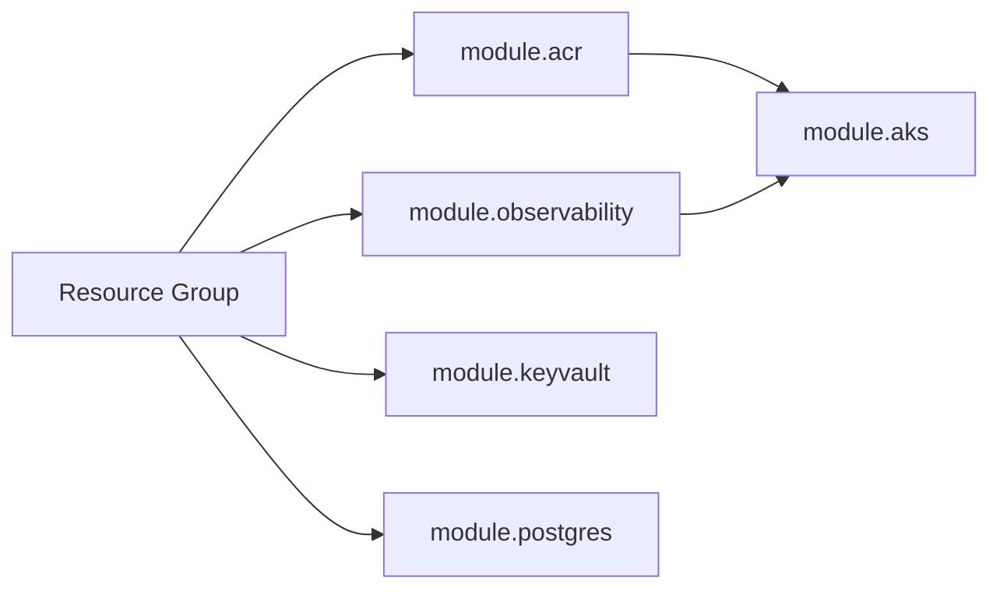

# Terraform Infrastructure

Complete reference for the Terraform codebase that provisions all Azure resources.

---

## State Backend

All Terraform state is stored remotely so that every CI run shares the same infrastructure view.

```hcl
# infra/providers.tf
terraform {
  required_version = ">= 1.7.0"

  required_providers {
    azurerm = {
      source  = "hashicorp/azurerm"
      version = "~> 3.114"
    }
    random = {
      source  = "hashicorp/random"
      version = "~> 3.6"
    }
  }

  backend "azurerm" {
    resource_group_name  = "rg-locationshared-tfstate"
    storage_account_name = "stlcsharedtfstate"
    container_name       = "tfstate"
    # key is passed at init time via -backend-config="key=<env>.terraform.tfstate"
    # dev  → dev.terraform.tfstate
    # prod → prod.terraform.tfstate
  }
}
```

The SP authenticates to the backend via **OIDC** (same credentials as the rest of the pipeline — `ARM_USE_OIDC=true`).

---

## Module Structure

```
infra/
├── main.tf           ← Root module: calls all child modules
├── providers.tf      ← AzureRM provider + remote backend
├── variables.tf      ← Input variable declarations
├── outputs.tf        ← Exports: RG name, AKS name, ACR name, etc.
├── environments/
│   ├── dev.tfvars    ← Dev-specific values (committed)
│   └── prod.tfvars   ← Prod-specific values
└── modules/
    ├── acr/          ← Azure Container Registry
    ├── aks/          ← AKS cluster + node pools + role assignment
    ├── keyvault/     ← Key Vault
    ├── observability/← Log Analytics Workspace + Application Insights
    └── postgres/     ← PostgreSQL Flexible Server + DB + firewall
```

---

## Root Module (`infra/main.tf`)

The root module wires together all child modules with shared variables:

```hcl
project_name = "locationshared"
environment  = "dev"
location     = "westeurope"
```

### Module call order (logical dependency)

```
observability → keyvault → acr → aks (depends on acr_id) → postgres
```



---

## Module Reference

### `modules/acr` — Azure Container Registry

| Resource | Name Pattern | Notes |
|---|---|---|
| `azurerm_container_registry` | `acrlocationshared{env}{random}` | Uses `random_id` suffix for global uniqueness |

- SKU: `Basic` (dev) — sufficient for small teams
- Admin user: disabled (AKS pulls via Managed Identity)

### `modules/aks` — AKS Cluster

| Resource | Name Pattern | Notes |
|---|---|---|
| `azurerm_kubernetes_cluster` | `aks-locationshared-{env}` | System node pool |
| `azurerm_kubernetes_cluster_node_pool` | `user` | Application workloads |
| `azurerm_role_assignment` | — | Grants AcrPull to kubelet identity |

**Key configuration choices:**

```hcl
sku_tier         = "Free"     # No SLA cost on Startup Credit subscription
os_disk_type     = "Managed"  # D2s_v5/D4s_v5 do NOT support Ephemeral OS
os_sku           = "AzureLinux"
local_account_disabled = false  # kubectl needs local accounts in CI (no AAD)
workload_identity_enabled = true
oidc_issuer_enabled       = true
network_plugin = "azure"    # Azure CNI
network_policy = "azure"    # Azure Network Policy
```

**Node pools:**

| Pool | VM Size | Count | Role |
|---|---|---|---|
| `system` | `Standard_D2s_v5` | 1 | Critical system pods only |
| `user` | `Standard_D4s_v5` | 2 | Application workloads |

**Why Managed disk instead of Ephemeral?**  
`Standard_D2s_v5` has only 8 GB temp disk — below the minimum required for Ephemeral OS (which needs space ≥ OS disk size, typically 128 GB). Both pools use `os_disk_type = "Managed"`.

### `modules/postgres` — PostgreSQL Flexible Server

| Resource | Name Pattern | Notes |
|---|---|---|
| `azurerm_postgresql_flexible_server` | `pg-locationshared-{env}` | **northeurope** hardcoded |
| `azurerm_postgresql_flexible_server_database` | `location_shared` | App database |
| `azurerm_postgresql_flexible_server_firewall_rule` | `allow-azure-services` | 0.0.0.0 → 0.0.0.0 |

```hcl
location  = "northeurope"   # hardcoded — westeurope is offer-restricted
version   = "16"
sku_name  = "B_Standard_B1ms"
storage_mb = 32768          # 32 GB
```

> **⚠️ Location Mismatch**: The PostgreSQL server is in `northeurope` while all other resources are in `westeurope`. This is intentional — see [Troubleshooting](./troubleshooting.md#postgresql-locationisofferrestricted).

**Zone drift fix**: PostgreSQL zone assignment can shift after HA failovers. Without the lifecycle block below, `terraform apply` would fail with `"zone can only be changed when exchanged with standby_availability_zone"`:

```hcl
lifecycle {
  ignore_changes = [zone]
}
```

This block is already present in `infra/modules/postgres/main.tf` and must not be removed.

### `modules/keyvault` — Azure Key Vault

Stores application secrets. AKS pods access secrets via Workload Identity.

### `modules/observability` — Log Analytics + Application Insights

| Resource | Name |
|---|---|
| Log Analytics Workspace | `law-locationshared-{env}` |
| Application Insights | `appi-locationshared-{env}` |

AKS OMS agent streams container logs to the Log Analytics workspace.

---

## Environments

### `environments/dev.tfvars`

```hcl
project_name             = "locationshared"
environment              = "dev"
location                 = "westeurope"
aks_node_count           = 2
aks_node_vm_size         = "Standard_D4s_v5"
postgres_admin_username  = "pgadminuser"
```

> `postgres_admin_password` is passed at runtime via GitHub Secret — never committed to the repository.

### `environments/prod.tfvars`

Similar structure to dev with production-grade sizing.

---

## Outputs

These outputs are captured by the CI pipeline and passed as environment variables to subsequent steps:

```hcl
output "resource_group_name" { value = azurerm_resource_group.main.name }
output "aks_name"            { value = module.aks.cluster_name }
output "acr_name"            { value = module.acr.name }
output "acr_login_server"    { value = module.acr.login_server }
output "postgres_fqdn"       { value = module.postgres.fqdn }
output "keyvault_name"       { value = module.keyvault.name }
```

---

## Running Terraform Locally

```bash
cd infra

# Authenticate
az login
az account set --subscription 4cf0d74f-7f78-413f-a9aa-9f97c39114d1

# Initialize (pulls state from Azure Blob)
export ARM_USE_OIDC=false
terraform init

# Plan
terraform plan \
  -var-file=environments/dev.tfvars \
  -var=postgres_admin_password=<password>

# Apply
terraform apply \
  -var-file=environments/dev.tfvars \
  -var=postgres_admin_password=<password>
```

---

## Known Constraints & Workarounds

| Constraint | Root Cause | Fix Applied |
|---|---|---|
| AZ zones 1 & 2 unavailable in westeurope | Startup Credit subscription limit | Removed `zones` from all resources |
| Ephemeral OS not supported on D2s_v5/D4s_v5 | Insufficient temp disk size | `os_disk_type = "Managed"` |
| PostgreSQL offer-restricted in westeurope | Startup Credit subscription | `location = "northeurope"` hardcoded |
| SP cannot create role assignments | Needs `User Access Administrator` not just `Contributor` | Granted `User Access Administrator` role |
| PostgreSQL name stuck after failed create | Azure internal name reservation | Renamed from `psql-` to `pg-` prefix |

See [Troubleshooting](./troubleshooting.md) for the full error messages and fix history.
